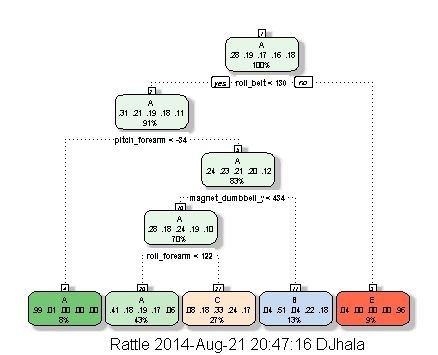

# Predicting Physical Activity
========================================================

## Abstract
This document provides a walkthrough for developing a model to predict which physical activity a subject is engaging in based on motion and angle data. It explains certain pitfalls, but mostly just presents findings and gives instructions to reproduce them.

## Getting Started
First, we'll prepare our workspace. With our environments empty, we're going to load in the data that we've saved into our working directory. We'll also load in the packages we'll be using for our analysis.


```r
library(caret)
```

```
## Loading required package: lattice
## Loading required package: ggplot2
```

```r
library(rattle)
```

```
## Rattle: A free graphical interface for data mining with R.
## Version 3.0.2 r169 Copyright (c) 2006-2013 Togaware Pty Ltd.
## Type 'rattle()' to shake, rattle, and roll your data.
```

```r
Testing <- read.csv("pml-testing.csv")
Training <- read.csv("pml-training.csv")
InTrain <- createDataPartition(y = Training$classe, p = 0.6, list = F)
Train1 <- Training[InTrain, ]
Test1 <- Training[-InTrain, ]
```

Now we've created a training partition and a testing partition. Let's have a quick look at the form of our data.


```r
summary(Train1)
```

```
##        X            user_name    raw_timestamp_part_1 raw_timestamp_part_2
##  Min.   :    1   adelmo  :2327   Min.   :1.32e+09     Min.   :   301      
##  1st Qu.: 4905   carlitos:1861   1st Qu.:1.32e+09     1st Qu.:254701      
##  Median : 9827   charles :2154   Median :1.32e+09     Median :497464      
##  Mean   : 9815   eurico  :1853   Mean   :1.32e+09     Mean   :499992      
##  3rd Qu.:14696   jeremy  :2039   3rd Qu.:1.32e+09     3rd Qu.:748293      
##  Max.   :19622   pedro   :1542   Max.   :1.32e+09     Max.   :998750      
##                                                                           
##           cvtd_timestamp new_window    num_window    roll_belt    
##  05/12/2011 11:24: 915   no :11532   Min.   :  1   Min.   :-28.9  
##  28/11/2011 14:14: 902   yes:  244   1st Qu.:221   1st Qu.:  1.1  
##  30/11/2011 17:11: 876               Median :425   Median :113.0  
##  05/12/2011 11:25: 840               Mean   :431   Mean   : 64.4  
##  02/12/2011 13:34: 836               3rd Qu.:646   3rd Qu.:123.0  
##  02/12/2011 14:57: 834               Max.   :864   Max.   :162.0  
##  (Other)         :6573                                            
##    pitch_belt        yaw_belt      total_accel_belt kurtosis_roll_belt
##  Min.   :-55.80   Min.   :-179.0   Min.   : 1.0              :11532   
##  1st Qu.:  1.74   1st Qu.: -88.3   1st Qu.: 3.0     #DIV/0!  :    7   
##  Median :  5.30   Median : -13.7   Median :17.0     -0.033935:    1   
##  Mean   :  0.35   Mean   : -11.5   Mean   :11.3     -0.034743:    1   
##  3rd Qu.: 14.90   3rd Qu.:  12.8   3rd Qu.:18.0     -0.060160:    1   
##  Max.   : 60.30   Max.   : 179.0   Max.   :29.0     -0.150950:    1   
##                                                     (Other)  :  233   
##  kurtosis_picth_belt kurtosis_yaw_belt skewness_roll_belt
##           :11532            :11532              :11532   
##  #DIV/0!  :   24     #DIV/0!:  244     #DIV/0!  :    6   
##  -0.684748:    3                       0.000000 :    2   
##  47.000000:    3                       -0.010002:    1   
##  -0.150950:    2                       -0.015465:    1   
##  -0.686349:    2                       -0.024325:    1   
##  (Other)  :  210                       (Other)  :  233   
##  skewness_roll_belt.1 skewness_yaw_belt max_roll_belt   max_picth_belt 
##           :11532             :11532     Min.   :-94     Min.   : 3     
##  #DIV/0!  :   24      #DIV/0!:  244     1st Qu.:-88     1st Qu.: 5     
##  -0.189082:    2                        Median : -6     Median :18     
##  -0.587156:    2                        Mean   : -6     Mean   :13     
##  -1.159179:    2                        3rd Qu.: 25     3rd Qu.:19     
##  -2.156553:    2                        Max.   :180     Max.   :27     
##  (Other)  :  212                        NA's   :11532   NA's   :11532  
##   max_yaw_belt   min_roll_belt   min_pitch_belt   min_yaw_belt  
##         :11532   Min.   :-180    Min.   : 1             :11532  
##  -1.4   :   21   1st Qu.: -88    1st Qu.: 3      -1.4   :   21  
##  -1.1   :   18   Median :  -9    Median :16      -1.1   :   18  
##  -1.3   :   17   Mean   : -10    Mean   :11      -1.3   :   17  
##  -1.2   :   15   3rd Qu.:  14    3rd Qu.:17      -1.2   :   15  
##  -0.7   :   13   Max.   : 173    Max.   :23      -0.7   :   13  
##  (Other):  160   NA's   :11532   NA's   :11532   (Other):  160  
##  amplitude_roll_belt amplitude_pitch_belt amplitude_yaw_belt
##  Min.   :  0         Min.   : 0                  :11532     
##  1st Qu.:  0         1st Qu.: 1           #DIV/0!:    7     
##  Median :  1         Median : 1           0.00   :    7     
##  Mean   :  4         Mean   : 2           0.0000 :  230     
##  3rd Qu.:  2         3rd Qu.: 2                             
##  Max.   :360         Max.   :11                             
##  NA's   :11532       NA's   :11532                          
##  var_total_accel_belt avg_roll_belt   stddev_roll_belt var_roll_belt  
##  Min.   : 0           Min.   :-27     Min.   : 0       Min.   :  0    
##  1st Qu.: 0           1st Qu.:  1     1st Qu.: 0       1st Qu.:  0    
##  Median : 0           Median :116     Median : 0       Median :  0    
##  Mean   : 1           Mean   : 67     Mean   : 1       Mean   :  7    
##  3rd Qu.: 0           3rd Qu.:123     3rd Qu.: 1       3rd Qu.:  0    
##  Max.   :13           Max.   :157     Max.   :13       Max.   :160    
##  NA's   :11532        NA's   :11532   NA's   :11532    NA's   :11532  
##  avg_pitch_belt  stddev_pitch_belt var_pitch_belt   avg_yaw_belt  
##  Min.   :-51     Min.   :0         Min.   : 0      Min.   :-138   
##  1st Qu.:  0     1st Qu.:0         1st Qu.: 0      1st Qu.: -88   
##  Median :  5     Median :0         Median : 0      Median :  -7   
##  Mean   :  0     Mean   :1         Mean   : 1      Mean   :  -9   
##  3rd Qu.: 14     3rd Qu.:1         3rd Qu.: 1      3rd Qu.:  18   
##  Max.   : 60     Max.   :4         Max.   :13      Max.   : 174   
##  NA's   :11532   NA's   :11532     NA's   :11532   NA's   :11532  
##  stddev_yaw_belt  var_yaw_belt    gyros_belt_x      gyros_belt_y    
##  Min.   :  0     Min.   :    0   Min.   :-1.0400   Min.   :-0.6400  
##  1st Qu.:  0     1st Qu.:    0   1st Qu.:-0.0300   1st Qu.: 0.0000  
##  Median :  0     Median :    0   Median : 0.0300   Median : 0.0200  
##  Mean   :  1     Mean   :   50   Mean   :-0.0035   Mean   : 0.0399  
##  3rd Qu.:  1     3rd Qu.:    1   3rd Qu.: 0.1100   3rd Qu.: 0.1100  
##  Max.   :109     Max.   :11928   Max.   : 2.2200   Max.   : 0.6400  
##  NA's   :11532   NA's   :11532                                      
##   gyros_belt_z    accel_belt_x     accel_belt_y    accel_belt_z   
##  Min.   :-1.46   Min.   :-82.00   Min.   :-69.0   Min.   :-275.0  
##  1st Qu.:-0.20   1st Qu.:-21.00   1st Qu.:  3.0   1st Qu.:-162.0  
##  Median :-0.10   Median :-15.00   Median : 35.0   Median :-152.0  
##  Mean   :-0.13   Mean   : -5.64   Mean   : 30.2   Mean   : -72.6  
##  3rd Qu.: 0.00   3rd Qu.: -5.00   3rd Qu.: 61.0   3rd Qu.:  27.0  
##  Max.   : 1.61   Max.   : 85.00   Max.   :150.0   Max.   : 105.0  
##                                                                   
##  magnet_belt_x   magnet_belt_y magnet_belt_z     roll_arm     
##  Min.   :-49.0   Min.   :354   Min.   :-623   Min.   :-180.0  
##  1st Qu.:  9.0   1st Qu.:581   1st Qu.:-375   1st Qu.: -32.8  
##  Median : 35.0   Median :601   Median :-320   Median :   0.0  
##  Mean   : 55.8   Mean   :594   Mean   :-346   Mean   :  17.2  
##  3rd Qu.: 59.0   3rd Qu.:610   3rd Qu.:-306   3rd Qu.:  76.9  
##  Max.   :485.0   Max.   :673   Max.   : 293   Max.   : 180.0  
##                                                               
##    pitch_arm         yaw_arm        total_accel_arm var_accel_arm  
##  Min.   :-88.20   Min.   :-180.00   Min.   : 1.0    Min.   :  0    
##  1st Qu.:-26.10   1st Qu.: -43.30   1st Qu.:17.0    1st Qu.:  8    
##  Median :  0.00   Median :   0.00   Median :27.0    Median : 40    
##  Mean   : -4.71   Mean   :  -0.43   Mean   :25.5    Mean   : 53    
##  3rd Qu.: 11.30   3rd Qu.:  46.30   3rd Qu.:33.0    3rd Qu.: 74    
##  Max.   : 88.50   Max.   : 180.00   Max.   :65.0    Max.   :332    
##                                                     NA's   :11532  
##   avg_roll_arm   stddev_roll_arm  var_roll_arm   avg_pitch_arm  
##  Min.   :-167    Min.   : 0      Min.   :   0    Min.   :-77    
##  1st Qu.: -41    1st Qu.: 1      1st Qu.:   1    1st Qu.:-21    
##  Median :   0    Median : 6      Median :  32    Median :  0    
##  Mean   :   7    Mean   :10      Mean   : 253    Mean   : -4    
##  3rd Qu.:  71    3rd Qu.:15      3rd Qu.: 236    3rd Qu.:  9    
##  Max.   : 149    Max.   :91      Max.   :8247    Max.   : 76    
##  NA's   :11532   NA's   :11532   NA's   :11532   NA's   :11532  
##  stddev_pitch_arm var_pitch_arm    avg_yaw_arm    stddev_yaw_arm 
##  Min.   : 0       Min.   :   0    Min.   :-173    Min.   :  0    
##  1st Qu.: 1       1st Qu.:   1    1st Qu.: -31    1st Qu.:  1    
##  Median : 8       Median :  65    Median :   0    Median : 15    
##  Mean   :10       Mean   : 190    Mean   :  -2    Mean   : 22    
##  3rd Qu.:16       3rd Qu.: 265    3rd Qu.:  32    3rd Qu.: 36    
##  Max.   :43       Max.   :1857    Max.   : 152    Max.   :177    
##  NA's   :11532    NA's   :11532   NA's   :11532   NA's   :11532  
##   var_yaw_arm     gyros_arm_x      gyros_arm_y      gyros_arm_z    
##  Min.   :    0   Min.   :-6.370   Min.   :-3.440   Min.   :-2.330  
##  1st Qu.:    1   1st Qu.:-1.330   1st Qu.:-0.800   1st Qu.:-0.070  
##  Median :  222   Median : 0.080   Median :-0.240   Median : 0.250  
##  Mean   : 1115   Mean   : 0.048   Mean   :-0.259   Mean   : 0.273  
##  3rd Qu.: 1282   3rd Qu.: 1.570   3rd Qu.: 0.140   3rd Qu.: 0.720  
##  Max.   :31345   Max.   : 4.870   Max.   : 2.840   Max.   : 3.020  
##  NA's   :11532                                                     
##   accel_arm_x      accel_arm_y      accel_arm_z    magnet_arm_x 
##  Min.   :-404.0   Min.   :-302.0   Min.   :-612   Min.   :-580  
##  1st Qu.:-241.0   1st Qu.: -54.0   1st Qu.:-143   1st Qu.:-298  
##  Median : -46.0   Median :  15.0   Median : -47   Median : 284  
##  Mean   : -61.3   Mean   :  32.8   Mean   : -71   Mean   : 191  
##  3rd Qu.:  82.0   3rd Qu.: 139.0   3rd Qu.:  23   3rd Qu.: 636  
##  Max.   : 435.0   Max.   : 303.0   Max.   : 271   Max.   : 780  
##                                                                 
##   magnet_arm_y   magnet_arm_z  kurtosis_roll_arm kurtosis_picth_arm
##  Min.   :-392   Min.   :-597           :11532            :11532    
##  1st Qu.:  -7   1st Qu.: 133   #DIV/0! :   50    #DIV/0! :   52    
##  Median : 202   Median : 447   -0.05695:    1    -0.00484:    1    
##  Mean   : 157   Mean   : 308   -0.08050:    1    -0.01311:    1    
##  3rd Qu.: 323   3rd Qu.: 546   -0.09698:    1    -0.02967:    1    
##  Max.   : 582   Max.   : 694   -0.11035:    1    -0.10385:    1    
##                                (Other) :  190    (Other) :  188    
##  kurtosis_yaw_arm skewness_roll_arm skewness_pitch_arm skewness_yaw_arm
##          :11532           :11532            :11532             :11532  
##  #DIV/0! :    7   #DIV/0! :   49    #DIV/0! :   52     #DIV/0! :    7  
##  0.65132 :    2   -0.00696:    1    -0.01247:    1     -1.62032:    2  
##  -0.04059:    1   -0.03359:    1    -0.02063:    1     0.55053 :    2  
##  -0.05333:    1   -0.03484:    1    -0.02652:    1     -0.00562:    1  
##  -0.06660:    1   -0.04186:    1    -0.02986:    1     -0.00800:    1  
##  (Other) :  232   (Other) :  191    (Other) :  188     (Other) :  231  
##   max_roll_arm   max_picth_arm    max_yaw_arm     min_roll_arm  
##  Min.   :-72     Min.   :-164    Min.   : 5      Min.   :-89    
##  1st Qu.:  0     1st Qu.:  -8    1st Qu.:30      1st Qu.:-42    
##  Median :  6     Median :  11    Median :34      Median :-23    
##  Mean   : 12     Mean   :  30    Mean   :35      Mean   :-20    
##  3rd Qu.: 27     3rd Qu.:  91    3rd Qu.:41      3rd Qu.:  0    
##  Max.   : 83     Max.   : 180    Max.   :62      Max.   : 66    
##  NA's   :11532   NA's   :11532   NA's   :11532   NA's   :11532  
##  min_pitch_arm    min_yaw_arm    amplitude_roll_arm amplitude_pitch_arm
##  Min.   :-180    Min.   : 1      Min.   :  0        Min.   :  0        
##  1st Qu.: -76    1st Qu.: 8      1st Qu.:  5        1st Qu.:  6        
##  Median : -38    Median :13      Median : 28        Median : 51        
##  Mean   : -36    Mean   :15      Mean   : 32        Mean   : 67        
##  3rd Qu.:   0    3rd Qu.:20      3rd Qu.: 51        3rd Qu.:114        
##  Max.   : 152    Max.   :38      Max.   :120        Max.   :360        
##  NA's   :11532   NA's   :11532   NA's   :11532      NA's   :11532      
##  amplitude_yaw_arm roll_dumbbell    pitch_dumbbell    yaw_dumbbell    
##  Min.   : 0        Min.   :-153.7   Min.   :-149.6   Min.   :-150.87  
##  1st Qu.:12        1st Qu.: -19.0   1st Qu.: -40.9   1st Qu.: -77.49  
##  Median :22        Median :  48.0   Median : -21.1   Median :  -4.15  
##  Mean   :21        Mean   :  23.5   Mean   : -10.9   Mean   :   1.71  
##  3rd Qu.:28        3rd Qu.:  67.7   3rd Qu.:  17.3   3rd Qu.:  80.18  
##  Max.   :52        Max.   : 153.4   Max.   : 149.4   Max.   : 154.95  
##  NA's   :11532                                                        
##  kurtosis_roll_dumbbell kurtosis_picth_dumbbell kurtosis_yaw_dumbbell
##         :11532                 :11532                  :11532        
##  -0.5855:    2          -2.0851:    2           #DIV/0!:  244        
##  -2.0851:    2          -0.0233:    1                                
##  #DIV/0!:    2          -0.0280:    1                                
##  -0.0035:    1          -0.0308:    1                                
##  -0.0262:    1          -0.0402:    1                                
##  (Other):  236          (Other):  238                                
##  skewness_roll_dumbbell skewness_pitch_dumbbell skewness_yaw_dumbbell
##         :11532                 :11532                  :11532        
##  0.1110 :    2          -0.3521:    2           #DIV/0!:  244        
##  1.0312 :    2          0.1090 :    2                                
##  -0.0096:    1          -0.0458:    1                                
##  -0.0172:    1          -0.0474:    1                                
##  -0.0224:    1          -0.0817:    1                                
##  (Other):  237          (Other):  237                                
##  max_roll_dumbbell max_picth_dumbbell max_yaw_dumbbell min_roll_dumbbell
##  Min.   :-70       Min.   :-104              :11532    Min.   :-150     
##  1st Qu.:-29       1st Qu.: -70       -0.6   :   15    1st Qu.: -61     
##  Median :  7       Median :  24       -0.8   :   15    Median : -45     
##  Mean   : 11       Mean   :  25       -0.2   :   11    Mean   : -43     
##  3rd Qu.: 48       3rd Qu.: 130       0.1    :   10    3rd Qu.: -28     
##  Max.   :137       Max.   : 155       -0.4   :    9    Max.   :  42     
##  NA's   :11532     NA's   :11532      (Other):  184    NA's   :11532    
##  min_pitch_dumbbell min_yaw_dumbbell amplitude_roll_dumbbell
##  Min.   :-147              :11532    Min.   :  0            
##  1st Qu.: -94       -0.6   :   15    1st Qu.: 13            
##  Median : -75       -0.8   :   15    Median : 33            
##  Mean   : -40       -0.2   :   11    Mean   : 54            
##  3rd Qu.:  12       0.1    :   10    3rd Qu.: 82            
##  Max.   : 116       -0.4   :    9    Max.   :237            
##  NA's   :11532      (Other):  184    NA's   :11532          
##  amplitude_pitch_dumbbell amplitude_yaw_dumbbell total_accel_dumbbell
##  Min.   :  0                     :11532          Min.   : 0.0        
##  1st Qu.: 16              #DIV/0!:    2          1st Qu.: 4.0        
##  Median : 41              0.00   :  242          Median :10.0        
##  Mean   : 65                                     Mean   :13.7        
##  3rd Qu.: 94                                     3rd Qu.:19.0        
##  Max.   :274                                     Max.   :58.0        
##  NA's   :11532                                                       
##  var_accel_dumbbell avg_roll_dumbbell stddev_roll_dumbbell
##  Min.   :  0        Min.   :-117      Min.   :  0         
##  1st Qu.:  0        1st Qu.: -14      1st Qu.:  4         
##  Median :  1        Median :  49      Median : 12         
##  Mean   :  5        Mean   :  24      Mean   : 20         
##  3rd Qu.:  3        3rd Qu.:  64      3rd Qu.: 27         
##  Max.   :230        Max.   : 126      Max.   :124         
##  NA's   :11532      NA's   :11532     NA's   :11532       
##  var_roll_dumbbell avg_pitch_dumbbell stddev_pitch_dumbbell
##  Min.   :    0     Min.   :-71        Min.   : 0           
##  1st Qu.:   18     1st Qu.:-43        1st Qu.: 3           
##  Median :  139     Median :-21        Median : 8           
##  Mean   :  970     Mean   :-15        Mean   :13           
##  3rd Qu.:  709     3rd Qu.: 10        3rd Qu.:19           
##  Max.   :15321     Max.   : 80        Max.   :83           
##  NA's   :11532     NA's   :11532      NA's   :11532        
##  var_pitch_dumbbell avg_yaw_dumbbell stddev_yaw_dumbbell var_yaw_dumbbell
##  Min.   :   0       Min.   :-114     Min.   :  0         Min.   :    0   
##  1st Qu.:   9       1st Qu.: -77     1st Qu.:  4         1st Qu.:   13   
##  Median :  63       Median : -13     Median : 11         Median :  112   
##  Mean   : 350       Mean   :  -6     Mean   : 17         Mean   :  636   
##  3rd Qu.: 353       3rd Qu.:  59     3rd Qu.: 23         3rd Qu.:  517   
##  Max.   :6836       Max.   : 135     Max.   :107         Max.   :11468   
##  NA's   :11532      NA's   :11532    NA's   :11532       NA's   :11532   
##  gyros_dumbbell_x  gyros_dumbbell_y gyros_dumbbell_z accel_dumbbell_x
##  Min.   :-204.00   Min.   :-2.10    Min.   : -2.3    Min.   :-419.0  
##  1st Qu.:  -0.03   1st Qu.:-0.14    1st Qu.: -0.3    1st Qu.: -51.0  
##  Median :   0.13   Median : 0.05    Median : -0.1    Median :  -8.0  
##  Mean   :   0.15   Mean   : 0.05    Mean   : -0.1    Mean   : -28.6  
##  3rd Qu.:   0.35   3rd Qu.: 0.21    3rd Qu.:  0.0    3rd Qu.:  11.0  
##  Max.   :   2.20   Max.   :52.00    Max.   :317.0    Max.   : 235.0  
##                                                                      
##  accel_dumbbell_y accel_dumbbell_z magnet_dumbbell_x magnet_dumbbell_y
##  Min.   :-189.0   Min.   :-273.0   Min.   :-643      Min.   :-3600    
##  1st Qu.:  -9.0   1st Qu.:-141.0   1st Qu.:-536      1st Qu.:  232    
##  Median :  41.0   Median :  -1.0   Median :-479      Median :  310    
##  Mean   :  52.7   Mean   : -37.9   Mean   :-330      Mean   :  223    
##  3rd Qu.: 111.0   3rd Qu.:  38.0   3rd Qu.:-307      3rd Qu.:  391    
##  Max.   : 315.0   Max.   : 318.0   Max.   : 592      Max.   :  632    
##                                                                       
##  magnet_dumbbell_z  roll_forearm     pitch_forearm     yaw_forearm    
##  Min.   :-250.0    Min.   :-180.00   Min.   :-72.50   Min.   :-180.0  
##  1st Qu.: -45.0    1st Qu.:  -0.83   1st Qu.:  0.00   1st Qu.: -68.8  
##  Median :  13.5    Median :  21.05   Median :  9.46   Median :   0.0  
##  Mean   :  46.4    Mean   :  33.98   Mean   : 10.81   Mean   :  19.2  
##  3rd Qu.:  96.0    3rd Qu.: 140.00   3rd Qu.: 28.20   3rd Qu.: 110.0  
##  Max.   : 452.0    Max.   : 180.00   Max.   : 89.80   Max.   : 180.0  
##                                                                       
##  kurtosis_roll_forearm kurtosis_picth_forearm kurtosis_yaw_forearm
##         :11532                :11532                 :11532       
##  #DIV/0!:   54         #DIV/0!:   55          #DIV/0!:  244       
##  -0.9169:    2         -0.0073:    1                              
##  -0.0227:    1         -0.0442:    1                              
##  -0.0359:    1         -0.0489:    1                              
##  -0.0567:    1         -0.0918:    1                              
##  (Other):  185         (Other):  185                              
##  skewness_roll_forearm skewness_pitch_forearm skewness_yaw_forearm
##         :11532                :11532                 :11532       
##  #DIV/0!:   53         #DIV/0!:   55          #DIV/0!:  244       
##  -0.0004:    1         -0.0113:    1                              
##  -0.0063:    1         -0.0131:    1                              
##  -0.0088:    1         -0.0405:    1                              
##  -0.0110:    1         -0.0478:    1                              
##  (Other):  187         (Other):  185                              
##  max_roll_forearm max_picth_forearm max_yaw_forearm min_roll_forearm
##  Min.   :-64      Min.   :-151             :11532   Min.   :-67     
##  1st Qu.:  0      1st Qu.:   0      #DIV/0!:   54   1st Qu.: -8     
##  Median : 24      Median : 111      -1.3   :   18   Median :  0     
##  Mean   : 24      Mean   :  78      -1.2   :   16   Mean   : -1     
##  3rd Qu.: 46      3rd Qu.: 175      -1.1   :   14   3rd Qu.: 12     
##  Max.   : 90      Max.   : 180      -1.6   :   14   Max.   : 62     
##  NA's   :11532    NA's   :11532     (Other):  128   NA's   :11532   
##  min_pitch_forearm min_yaw_forearm amplitude_roll_forearm
##  Min.   :-180             :11532   Min.   :  0           
##  1st Qu.:-176      #DIV/0!:   54   1st Qu.:  1           
##  Median : -49      -1.3   :   18   Median : 17           
##  Mean   : -55      -1.2   :   16   Mean   : 24           
##  3rd Qu.:   0      -1.1   :   14   3rd Qu.: 40           
##  Max.   : 167      -1.6   :   14   Max.   :112           
##  NA's   :11532     (Other):  128   NA's   :11532         
##  amplitude_pitch_forearm amplitude_yaw_forearm total_accel_forearm
##  Min.   :  0                    :11532         Min.   :  0.0      
##  1st Qu.:  2             #DIV/0!:   54         1st Qu.: 29.0      
##  Median : 76             0.00   :  190         Median : 36.0      
##  Mean   :133                                   Mean   : 34.6      
##  3rd Qu.:350                                   3rd Qu.: 41.0      
##  Max.   :360                                   Max.   :108.0      
##  NA's   :11532                                                    
##  var_accel_forearm avg_roll_forearm stddev_roll_forearm var_roll_forearm
##  Min.   :  0       Min.   :-177     Min.   :  0         Min.   :    0   
##  1st Qu.:  6       1st Qu.:   0     1st Qu.:  0         1st Qu.:    0   
##  Median : 22       Median :  10     Median :  6         Median :   38   
##  Mean   : 33       Mean   :  35     Mean   : 37         Mean   : 4541   
##  3rd Qu.: 49       3rd Qu.: 119     3rd Qu.: 55         3rd Qu.: 3091   
##  Max.   :173       Max.   : 177     Max.   :179         Max.   :32102   
##  NA's   :11532     NA's   :11532    NA's   :11532       NA's   :11532   
##  avg_pitch_forearm stddev_pitch_forearm var_pitch_forearm avg_yaw_forearm
##  Min.   :-65       Min.   : 0           Min.   :   0      Min.   :-155   
##  1st Qu.:  0       1st Qu.: 0           1st Qu.:   0      1st Qu.: -24   
##  Median : 12       Median : 5           Median :  29      Median :   0   
##  Mean   : 11       Mean   : 8           Mean   : 136      Mean   :  18   
##  3rd Qu.: 28       3rd Qu.:12           3rd Qu.: 151      3rd Qu.:  90   
##  Max.   : 72       Max.   :38           Max.   :1436      Max.   : 169   
##  NA's   :11532     NA's   :11532        NA's   :11532     NA's   :11532  
##  stddev_yaw_forearm var_yaw_forearm gyros_forearm_x   gyros_forearm_y 
##  Min.   :  0        Min.   :    0   Min.   :-22.000   Min.   : -7.02  
##  1st Qu.:  1        1st Qu.:    0   1st Qu.: -0.220   1st Qu.: -1.46  
##  Median : 21        Median :  439   Median :  0.050   Median :  0.03  
##  Mean   : 43        Mean   : 4528   Mean   :  0.156   Mean   :  0.08  
##  3rd Qu.: 82        3rd Qu.: 6733   3rd Qu.:  0.560   3rd Qu.:  1.61  
##  Max.   :198        Max.   :39009   Max.   :  3.970   Max.   :311.00  
##  NA's   :11532      NA's   :11532                                     
##  gyros_forearm_z  accel_forearm_x  accel_forearm_y accel_forearm_z 
##  Min.   : -7.94   Min.   :-498.0   Min.   :-496    Min.   :-391.0  
##  1st Qu.: -0.18   1st Qu.:-177.0   1st Qu.:  53    1st Qu.:-182.0  
##  Median :  0.08   Median : -57.0   Median : 201    Median : -38.0  
##  Mean   :  0.16   Mean   : -62.1   Mean   : 163    Mean   : -54.9  
##  3rd Qu.:  0.49   3rd Qu.:  75.0   3rd Qu.: 312    3rd Qu.:  26.0  
##  Max.   :231.00   Max.   : 477.0   Max.   : 923    Max.   : 287.0  
##                                                                    
##  magnet_forearm_x magnet_forearm_y magnet_forearm_z classe  
##  Min.   :-1280    Min.   :-890.0   Min.   :-966     A:3348  
##  1st Qu.: -614    1st Qu.:  -5.2   1st Qu.: 184     B:2279  
##  Median : -378    Median : 592.0   Median : 509     C:2054  
##  Mean   : -312    Mean   : 378.9   Mean   : 391     D:1930  
##  3rd Qu.:  -73    3rd Qu.: 737.0   3rd Qu.: 651     E:2165  
##  Max.   :  663    Max.   :1460.0   Max.   :1080             
## 
```

The first thing to notice is all the missing data. About two thirds of the columns have no data for more than 90% of the observations. If we were only missing a few, we'd impute the missing data, but as it is the data wouldn't be very good.

## Cleaning
We're going to remove that bad data. There are a couple ways to do it. We could notice that none of the variables with missing data are numeric or integers, and build a new dataframe consisting only of columns meeting that requirement and the "classe" column. We could also just note the column numbers of the bad columns and remove those. We're also going to remove columns that have data, but aren't really applicable. Even though the first few columns actually present an almost perfect model for in sample, it would be the definition of tuning to the noise. Unsurprisingly, a person is more likely to be walking if he was walking the second before or after. It doesn't really solve the question at hand to look at that.


```r
fTrain1 <- Train1[-c(1:7)]
fTrain1 <- fTrain1[-c(7, 10:29)]
fTrain1 <- fTrain1[-c(5:8, 22:31, 41:55)]
fTrain1 <- fTrain1[-c(30:44)]
fTrain1 <- fTrain1[-c(31:40)]
fTrain1 <- fTrain1[-c(43:57)]
fTrain1 <- fTrain1[-c(44:53)]
```

## Looking for a model
In general, it should be noted that black-box prediction is not a good thing. In an ideal world, we would first learn something about the theory behind the data we're analyzing. This helps with feature selection and helps prevent tuning to noise. Unfortunately, that's beyond the scope of this assignment. So instead we're going to look at a few different prediction methods.

First we'll try building a single tree.


```r
fit1 <- train(classe ~ ., method = "rpart", data = fTrain1, trControl = trainControl(method = "cv", 
    number = 4))
```

```
## Loading required package: rpart
```

```r
fit1
```

```
## CART 
## 
## 11776 samples
##    52 predictors
##     5 classes: 'A', 'B', 'C', 'D', 'E' 
## 
## No pre-processing
## Resampling: Cross-Validated (4 fold) 
## 
## Summary of sample sizes: 8832, 8831, 8833, 8832 
## 
## Resampling results across tuning parameters:
## 
##   cp    Accuracy  Kappa  Accuracy SD  Kappa SD
##   0.03  0.5       0.4    0.02         0.03    
##   0.06  0.4       0.2    0.07         0.1     
##   0.1   0.3       0.09   0.04         0.06    
## 
## Accuracy was used to select the optimal model using  the largest value.
## The final value used for the model was cp = 0.03.
```

As we can see, the single tree wasn't very accurate. Fortunately, a single tree is really easy to visualize. It's worth doing that just to get a feel for what's actually taking place.


```r
fancyRpartPlot(fit1$finalModel)
```

```
## Loading required package: rpart.plot
## Loading required package: RColorBrewer
```

 

Now we're going to look at more complicated models. The first one is a bagged tree. It should be relatively fast and accurate.


```r
fit4 <- fit4 <- train(classe ~ ., method = "treebag", data = fTrain1)
```

```
## Loading required package: ipred
## Loading required package: plyr
```

```r
fit4
```

```
## Bagged CART 
## 
## 11776 samples
##    52 predictors
##     5 classes: 'A', 'B', 'C', 'D', 'E' 
## 
## No pre-processing
## Resampling: Bootstrapped (25 reps) 
## 
## Summary of sample sizes: 11776, 11776, 11776, 11776, 11776, 11776, ... 
## 
## Resampling results
## 
##   Accuracy  Kappa  Accuracy SD  Kappa SD
##   1         1      0.004        0.005   
## 
## 
```

Let's check it against our test set for cross validation purposes. This should give us a good idea of our out of sample error rate, which will be roughly 1- the number below.


```r
mean(Test1$classe == predict(fit4, Test1))
```

```
## [1] 0.982
```

Another good prediction method is a random forest. Random forests bootstrap as a part of constructing the forest in the first place, so we can use a simple out of bag sampling method with them. That lets us build them relatively quickly. Let's try one now. We're going to build a conditional inference random forest.


```r
fit5 <- train(classe ~ ., method = "cforest", data = fTrain1, trControl = trainControl(method = "oob"))
```

```
## Loading required package: party
## Loading required package: grid
## Loading required package: zoo
## 
## Attaching package: 'zoo'
## 
## The following objects are masked from 'package:base':
## 
##     as.Date, as.Date.numeric
## 
## Loading required package: sandwich
## Loading required package: strucchange
## Loading required package: modeltools
## Loading required package: stats4
## 
## Attaching package: 'modeltools'
## 
## The following object is masked from 'package:plyr':
## 
##     empty
```

```r
fit5
```

```
## Conditional Inference Random Forest 
## 
## 11776 samples
##    52 predictors
##     5 classes: 'A', 'B', 'C', 'D', 'E' 
## 
## No pre-processing
## Resampling: Out of Bag Resampling 
## 
## Summary of sample sizes:  
## 
## Resampling results across tuning parameters:
## 
##   mtry  Accuracy  Kappa
##   2     1         1    
##   4     1         1    
##   6     1         1    
## 
## Accuracy was used to select the optimal model using  the largest value.
## The final value used for the model was mtry = 6.
```

As you can see the accuracy is pretty similar to what we got with the bagged tree. Let's check our out of sample accuracy on this one too.


```r
mean(Test1$classe == predict(fit5, Test1))
```

```
## [1] 0.9553
```

It's worthwhile to compare how long these models take to fit. 


```r
fit1$times
```

```
## $everything
##    user  system elapsed 
##   15.72    0.10   15.95 
## 
## $final
##    user  system elapsed 
##    2.27    0.01    2.30 
## 
## $prediction
## [1] NA NA NA
```

```r
fit4$times
```

```
## $everything
##    user  system elapsed 
## 1767.66    1.84 1773.03 
## 
## $final
##    user  system elapsed 
##   67.66    0.00   67.74 
## 
## $prediction
## [1] NA NA NA
```

```r
fit5$times
```

```
## $everything
##    user  system elapsed 
## 3173.08    2.85 3263.07 
## 
## $final
##    user  system elapsed 
##  325.61    0.03  329.36 
## 
## $prediction
## [1] NA NA NA
```


Given the choice between a regular single tree, a bagged tree, and a conditional inference random forest, the bagged tree provides the best mix of speed of calculation and accuracy. We'll use that to make our predictions for the test.


```r
predict(fit4, Testing)
```

```
##  [1] B A B A A E D B A A B C B A E E A B B B
## Levels: A B C D E
```
