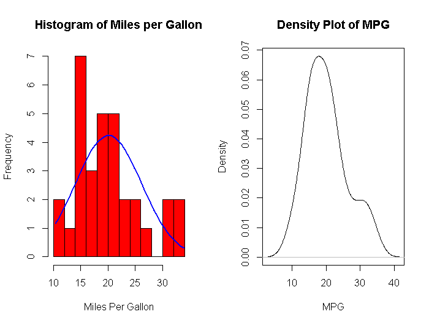
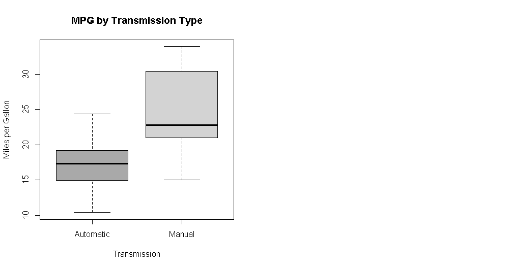
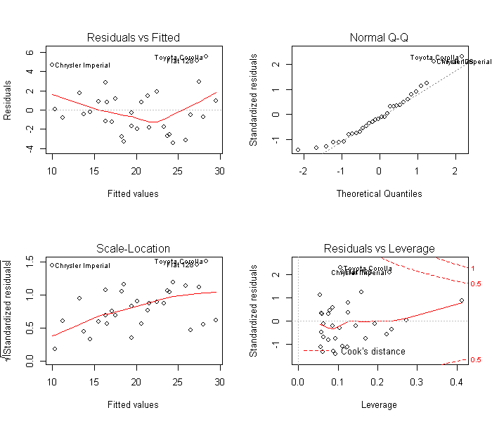

# Automatic or Manual: A regression analysis using the mtcars dataset


## Executive Summary

Do cars with manual transmission behave more favorably than automatic transmission cars with respect to fuel efficiency? It is a common belief that changing gears manually results in better fuel management. In this report we will use a dataset from the 1974 Motor Trend US magazine to answer the following questions:
.Is an automatic or manual transmission better for miles per gallon (MPG)?
.How different is the MPG between automatic and manual transmissions?

Using hypothesis testing and simple linear regression, we determine that there is a signficant difference between the mean MPG for automatic and manual transmission cars, with the latter having 7.245 more MPGs on average. However, in order to adjust for other confounding variables such as the weight and horsepower of the car, we ran a multivariate regression to get a better estimate the impact of transmission type on MPG. After validating the model using ANOVA, the results from the multivariate regression reveal that, on average, manual transmission cars get 2.084 miles per gallon more than automatic transmission cars.

## Data Processing

Data is first downloaded from https://d396qusza40orc.cloudfront.net/repdata/data/StormData.csv.bz2. The data is then read in and summary data is removed.

### Reading the mtcars Data
```r
data(mtcars)
```
Here we see that our predictor variable of interest, am, is a numeric class. Since we are dealing with a dichotomous variable, let's convert this to a factor class and label the levels as Automatic and Manual for better interpretability.
```r
mtcars$am <- as.factor(mtcars$am)
levels(mtcars$am) <- c("Automatic", "Manual")
```
## Exploratory Data Analysis
Since we will be running a linear regression, we want to make sure that its assumptions are met. Let's plot the dependent variable mpg to check its distribution.
```r
par(mfrow = c(1, 2))
# Histogram with Normal Curve
x <- mtcars$mpg
h<-hist(x, breaks=10, col="red", xlab="Miles Per Gallon",
   main="Histogram of Miles per Gallon")
xfit<-seq(min(x),max(x),length=40)
yfit<-dnorm(xfit,mean=mean(x),sd=sd(x))
yfit <- yfit*diff(h$mids[1:2])*length(x)
lines(xfit, yfit, col="blue", lwd=2)

# Kernel Density Plot
d <- density(mtcars$mpg)
plot(d, xlab = "MPG", main ="Density Plot of MPG")
```


The distribution of mpg is approximately normal and there are no apparent outliers skewing our data. Great! Now let's check how mpg varies by automatic versus manual transmission.
```r
boxplot(mpg~am, data = mtcars,
        col = c("dark grey", "light grey"),
        xlab = "Transmission",
        ylab = "Miles per Gallon",
        main = "MPG by Transmission Type")
```



Again, there are no apparent outlier in our dataset. Morever, we can easily see a difference in the MPG by transmission type. As suspected, manual transmission seems to get better miles per gallon than automatic transmission. However, we should dig deeper.

## Hypothesis Testing
```r
aggregate(mpg~am, data = mtcars, mean)
```
```
##          am   mpg
## 1 Automatic 17.15
## 2    Manual 24.39
```
The mean MPG of manual transmission cars is 7.245 MPGs higher than that of automatic transmission cars. Is this a significant difference? We set our alpha-value at 0.5 and run a t-test to find out.

```r
autoData <- mtcars[mtcars$am == "Automatic",]
manualData <- mtcars[mtcars$am == "Manual",]
t.test(autoData$mpg, manualData$mpg)
```
```
## 
##  Welch Two Sample t-test
## 
## data:  autoData$mpg and manualData$mpg
## t = -3.767, df = 18.33, p-value = 0.001374
## alternative hypothesis: true difference in means is not equal to 0
## 95 percent confidence interval:
##  -11.28  -3.21
## sample estimates:
## mean of x mean of y 
##     17.15     24.39
```
With a p-value of 0.001374, we reject the null hypothesis and claim that there is a signficiant difference in the mean MPG between manual transmission cars and that of automatic transmission cars. Now we must quantify that difference.

## Building our Model

### Correlation
To determine which predictors should go into our model, we create a correlation matrix for the mtcars dataset and look at the row for mpg.

```r
data(mtcars)
sort(cor(mtcars)[1,])
```
```
##      wt     cyl    disp      hp    carb    qsec    gear      am      vs 
## -0.8677 -0.8522 -0.8476 -0.7762 -0.5509  0.4187  0.4803  0.5998  0.6640 
##    drat     mpg 
##  0.6812  1.0000
```
In addition to am (which by default must be included in our regression model), we see that wt, cyl, disp, and hp are highly correlated with our dependent variable mpg. As such, they may be good candidates to include in our model. However, if we look at the correlation matrix, we also see that cyl and disp are highly correlated with each other. Since predictors should not exhibit collinearity, we should not have cyl and disp in in our model.

Including wt and hp in our regression equation makes sense intuitively - heavier cars and cars that have more horsepower should have lower MPGs.

## Regression Analysis

### Simple Linear Regression

To begin our model testing, we fit a simple linear regression for mpg on am.

```r
fit <- lm(mpg~am, data = mtcars)
summary(fit)
```
```
## 
## Call:
## lm(formula = mpg ~ am, data = mtcars)
## 
## Residuals:
##    Min     1Q Median     3Q    Max 
## -9.392 -3.092 -0.297  3.244  9.508 
## 
## Coefficients:
##             Estimate Std. Error t value Pr(>|t|)    
## (Intercept)    17.15       1.12   15.25  1.1e-15 ***
## am              7.24       1.76    4.11  0.00029 ***
## ---
## Signif. codes:  0 '***' 0.001 '**' 0.01 '*' 0.05 '.' 0.1 ' ' 1
## 
## Residual standard error: 4.9 on 30 degrees of freedom
## Multiple R-squared:  0.36,   Adjusted R-squared:  0.338 
## F-statistic: 16.9 on 1 and 30 DF,  p-value: 0.000285
```
We do not gain much more information from our hypothesis test using this model. Interpreting the coefficient and intercepts, we say that, on average, automatic cars have 17.147 MPG and manual transmission cars have 7.245 MPGs more. In addition, we see that the R^2 value is 0.3598. This means that our model only explains 35.98% of the variance.

### Multivariate Linear Regression

Next, we fit a multivariate linear regression for mpg on am, wt, and hp. Since we have two models of the same data, we run an ANOVA to compare the two models and see if they are significantly different.

```r
bestfit <- lm(mpg~am + wt + hp, data = mtcars)
anova(fit, bestfit)
```

```
## Analysis of Variance Table
## 
## Model 1: mpg ~ am
## Model 2: mpg ~ am + wt + hp
##   Res.Df RSS Df Sum of Sq  F  Pr(>F)    
## 1     30 721                            
## 2     28 180  2       541 42 3.7e-09 ***
## ---
## Signif. codes:  0 '***' 0.001 '**' 0.01 '*' 0.05 '.' 0.1 ' ' 1
```
With a p-value of 3.745e-09, we reject the null hypothesis and claim that our multivariate model is significantly different from our simple model.

Before we report the details of our model, it is important to check the residuals for any signs of non-normality and examine the residuals vs. fitted values plot to spot for any signs of heteroskedasticity.

```r
par(mfrow = c(2,2))
plot(bestfit)
```


Our residuals are normally distributed and homoskedastic. We can now report the estimates from our final model.
```r
summary(bestfit)
```
```
## 
## Call:
## lm(formula = mpg ~ am + wt + hp, data = mtcars)
## 
## Residuals:
##    Min     1Q Median     3Q    Max 
## -3.422 -1.792 -0.379  1.225  5.532 
## 
## Coefficients:
##             Estimate Std. Error t value Pr(>|t|)    
## (Intercept) 34.00288    2.64266   12.87  2.8e-13 ***
## am           2.08371    1.37642    1.51  0.14127    
## wt          -2.87858    0.90497   -3.18  0.00357 ** 
## hp          -0.03748    0.00961   -3.90  0.00055 ***
## ---
## Signif. codes:  0 '***' 0.001 '**' 0.01 '*' 0.05 '.' 0.1 ' ' 1
## 
## Residual standard error: 2.54 on 28 degrees of freedom
## Multiple R-squared:  0.84,   Adjusted R-squared:  0.823 
## F-statistic:   49 on 3 and 28 DF,  p-value: 2.91e-11
```
This model explains over 83.99% of the variance. Moreover, we see that wt and hp did indeed confound the relationship between am and mpg (mostly wt). Now when we read the coefficient for am, we say that, on average, manual transmission cars have 2.084 MPGs more than automatic transmission cars.

